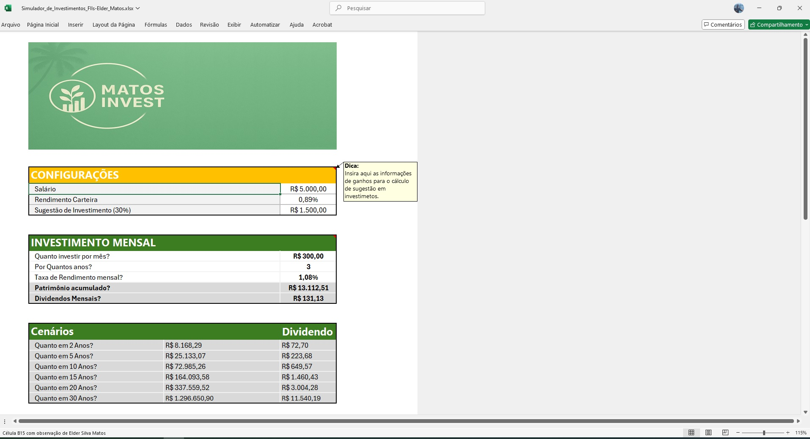
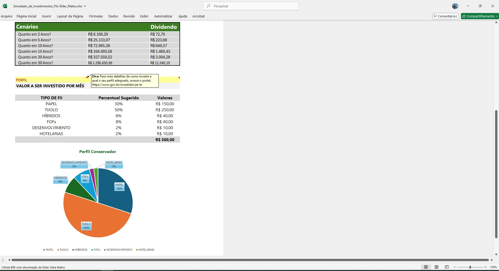

# Simulador de investimentos

#Planilha para simular investimentos em FII's.

Com este simulador de investimentos em FII's você poderá ver alguns possíveis cenários sugeridos para começar a investir em FII's, com uma carteira diversificada e assim iniciar um futuro mais estável.

Links importantes:

[Site com dicas de investimento](https://www.gov.br/investidor/pt-br)

## Passo 1: Configuração inicial

Primeiro insira as informações de ganhos para verificar a sugestão de investimento mensal.

## Passo 2: Configurando valores e períodos

Informe o quanto pretende investir mensalmente e o prazo para que o simulador faça os cálculos dos possíveis ganhos com base na taxa de rendimento sugerido.

Após informar estes dados você terá o resultado de alguns cenários além do prazo escolhido.

## Passo 3: Configurando o investimento em FII's

Neste recurso você poderá escolher o seu perfil de investidor e valor que pretende aplicar.

Em seguida você terá as sugestões de quanto deverá aplicar em cada tipo de FII e quanto poderá obter com esses investimentos. 

## Aviso Legal. (Importante!):
Este simulador é apenas uma sugestão de investimento e visa auxiliar sua análise financeira e não deve ser interpretada como recomendação definitiva. A responsabilidade por decisões de investimento é exclusivamente do usuário.
